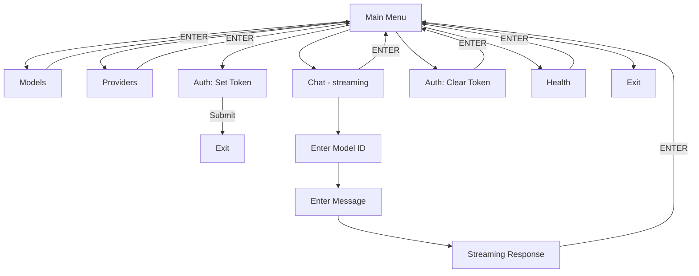
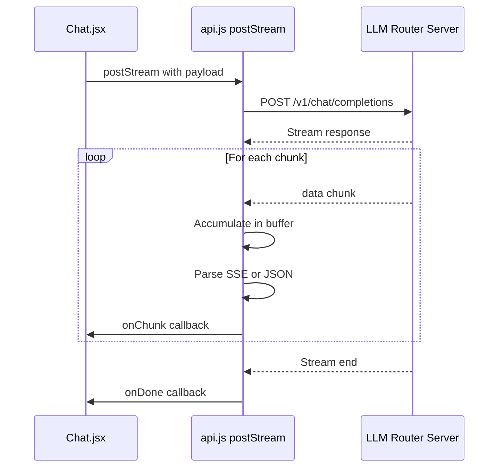

# CLI Application Test Plan

## Application Overview

The LLM Router CLI is a terminal-based interactive frontend built with React and Ink framework. It provides a menu-driven interface for interacting with the LLM Router backend service.

### Technology Stack
- **Framework**: React 18.2.0 with Ink 4.4.1 (terminal UI)
- **UI Components**: @inkjs/ui (Select menus), ink-text-input (text input)
- **HTTP Client**: undici 5.0.0
- **Runtime**: Node.js with tsx for JSX execution

---

## Application Structure

```
cli/
├── package.json           # Dependencies and scripts
├── src/
│   ├── index.jsx         # Main entry point and App component
│   ├── api.js            # HTTP API client with streaming support
│   ├── config.js         # Token/config file management
│   └── components/
│       ├── Chat.jsx      # Streaming chat interface
│       ├── Models.jsx    # Model listing
│       └── Providers.jsx # Provider status display
└── test/
    └── run_tests.js      # Test runner
```

---

## Menu Flow Diagram



---

## Menu Options Detail

### 1. Models
**Navigation**: Main Menu → Models

**API Endpoint**: `GET /v1/models`

**Display**:
- Lists up to 50 models
- Shows: `model_id — owned_by [capabilities]`
- Example: `gpt-4 — openai [chat, completion]`

**User Interactions**:
- View scrollable list of models
- Press ENTER to return to menu
- Press ESC to quit application

**Error Handling**:
- Displays red error text on API failure
- Shows "Loading models..." during fetch

---

### 2. Providers
**Navigation**: Main Menu → Providers

**API Endpoint**: `GET /providers`

**Display**:
- Lists up to 50 providers
- Shows availability status (green=available, red=unavailable)
- Displays rate limits: `rpd_used=X rpm_used=Y`
- Shows cache information as JSON

**User Interactions**:
- View provider status list
- Press ENTER to return to menu
- Press ESC to quit application

**Error Handling**:
- Displays red error text on API failure
- Shows "Loading provider stats..." during fetch

---

### 3. Chat (Streaming)
**Navigation**: Main Menu → Chat (streaming)

**API Endpoint**: `POST /v1/chat/completions`

**Flow**:
1. **Step 1 - Model Input**: Enter model ID or leave blank for auto-selection
2. **Step 2 - Message Input**: Enter the chat message
3. **Step 3 - Response**: Streaming response displayed in real-time

**Request Payload**:
```json
{
  "model": "<model_id or undefined>",
  "messages": [{ "role": "user", "content": "<message>" }],
  "stream": true
}
```

**User Interactions**:
- Type model ID and press ENTER
- Type message and press ENTER to send
- View streaming response
- Press ENTER to return to menu after completion

**Error Handling**:
- Shows `[error] <error_message>` appended to response
- Response displayed in red on error, green on success

---

### 4. Auth: Set Token
**Navigation**: Main Menu → Auth: Set Token

**Action**: Saves API token to `~/.llm-router-cli/config.json`

**User Interactions**:
- Paste token text
- Press ENTER to save and exit application

**Token Priority**:
1. Environment variable `LLM_ROUTER_TOKEN` (highest)
2. Config file token

---

### 5. Auth: Clear Token
**Navigation**: Main Menu → Auth: Clear Token

**Action**: Removes token from config file

**Display**:
- "Token cleared." message
- Prompt to press ENTER to return

**User Interactions**:
- Automatic token clearing
- Press ENTER to return to menu

---

### 6. Health
**Navigation**: Main Menu → Health

**API Endpoint**: `GET /health`

**Display**:
- Status message
- Provider availability count: `providers X/Y`

**User Interactions**:
- View health status
- Press ENTER to return to menu

**Error Handling**:
- Shows error object on failure

---

### 7. Exit
**Navigation**: Main Menu → Exit

**Action**: Calls `process.exit(0)` to terminate application

---

## API Endpoints Summary

| Endpoint | Method | Auth | Description |
|----------|--------|------|-------------|
| `/health` | GET | No | Health check with provider count |
| `/v1/models` | GET | No | List available models |
| `/providers` | GET | No | Provider status and cache info |
| `/v1/chat/completions` | POST | Yes | Chat completions with streaming |

### Base URL Configuration
- Default: `http://localhost:8080`
- Environment Variable: `LLM_ROUTER_URL`

### Authentication
- Header: `Authorization: Bearer <token>`
- Token sources (priority order):
  1. `LLM_ROUTER_TOKEN` environment variable
  2. `~/.llm-router-cli/config.json` file

---

## Error Handling Patterns

### API Module (`api.js`)

1. **JSON Parse Fallback**: If JSON parsing fails, returns raw text
   ```javascript
   try {
     return JSON.parse(text);
   } catch (e) {
     return text;
   }
   ```

2. **Stream Error Handling**: Errors passed to callback
   ```javascript
   body.on('error', (err) => onError && onError(err));
   ```

3. **Stream Chunk Processing**: Wrapped in try/catch to swallow handler errors
   ```javascript
   } catch (e) {
     // swallow handler errors
   }
   ```

### Component Level

1. **Models.jsx**: 
   - Error state displayed in red
   - Loading state shown during fetch
   - Cleanup on unmount with `mounted` flag

2. **Providers.jsx**:
   - Same pattern as Models

3. **Chat.jsx**:
   - Error appended to response with `[error]` prefix
   - Loading state during streaming

4. **Config Module**:
   - Silent failures on directory creation
   - Returns `{}` on read errors
   - Returns `false` on write errors

---

## Chat Streaming Implementation

### Overview
The streaming implementation in [`api.js`](cli/src/api.js:41) handles Server-Sent Events (SSE) format and raw JSON chunks.

### Flow



### Implementation Details

1. **Buffer Accumulation**: Chunks are accumulated in a buffer and split on newlines
   ```javascript
   buf += s;
   const parts = buf.split(/\r?\n/);
   buf = parts.pop() || '';
   ```

2. **SSE Parsing**: Lines starting with `data:` are parsed as SSE format
   ```javascript
   if (line.startsWith('data:')) {
     const v = line.replace(/^data:\s*/i, '');
     // Parse JSON or return raw
   }
   ```

3. **JSON Fallback**: Non-SSE lines are attempted as JSON parse
   ```javascript
   try {
     const parsed = JSON.parse(line);
     onChunk(JSON.stringify(parsed));
   } catch (_) {
     onChunk(line); // Raw text fallback
   }
   ```

4. **Keep-alive Handling**: Empty lines are ignored
   ```javascript
   if (!trimmed) continue;
   ```

### Known Issues / Edge Cases

1. **Partial JSON Fragments**: The buffer handles partial lines but may have issues with JSON split across chunks

2. **Error Swallowing**: Handler errors in chunk processing are silently swallowed (line 100-101)

3. **No Timeout**: No request timeout configured - could hang indefinitely

4. **BackListener in Chat**: Uses `useApp().exit()` instead of returning to menu properly (potential navigation issue)

---

## Test Plan

### Prerequisites
- Backend server running at `http://localhost:8080` (or set `LLM_ROUTER_URL`)
- At least one provider configured and available
- Valid API token (if authentication required)

### Test Cases

#### TC-001: Application Startup
| Step | Action | Expected Result |
|------|--------|-----------------|
| 1 | Run `npm start` in cli/ directory | Application displays main menu |
| 2 | Verify menu options | All 7 options visible: Models, Providers, Chat, Auth Set, Auth Clear, Health, Exit |

#### TC-002: Models Menu
| Step | Action | Expected Result |
|------|--------|-----------------|
| 1 | Select "Models" | Shows "Loading models..." |
| 2 | Wait for load | List of models displayed with format: `id — owned_by [capabilities]` |
| 3 | Press ENTER | Returns to main menu |
| 4 | Select "Models" again | Models load and display |
| 5 | Press ESC | Application exits |

#### TC-003: Providers Menu
| Step | Action | Expected Result |
|------|--------|-----------------|
| 1 | Select "Providers" | Shows "Loading provider stats..." |
| 2 | Wait for load | Provider list with availability status (green/red) |
| 3 | Verify display | Shows `rpd_used` and `rpm_used` values |
| 4 | Verify cache | Cache JSON displayed at bottom |
| 5 | Press ENTER | Returns to main menu |

#### TC-004: Health Check
| Step | Action | Expected Result |
|------|--------|-----------------|
| 1 | Select "Health" | Shows "Checking health..." briefly |
| 2 | Verify response | Displays `Status: ok — providers X/Y` |
| 3 | Press ENTER | Returns to main menu |

#### TC-005: Auth Set Token
| Step | Action | Expected Result |
|------|--------|-----------------|
| 1 | Select "Auth: Set Token" | Shows prompt to paste token |
| 2 | Enter "test-token-123" | Application exits |
| 3 | Check `~/.llm-router-cli/config.json` | File contains `{"token": "test-token-123"}` |
| 4 | Restart application | Token available for API calls |

#### TC-006: Auth Clear Token
| Step | Action | Expected Result |
|------|--------|-----------------|
| 1 | Set a token first | Token saved in config |
| 2 | Select "Auth: Clear Token" | Shows "Token cleared." |
| 3 | Press ENTER | Returns to main menu |
| 4 | Check config file | Token removed from config |

#### TC-007: Chat - Basic Flow
| Step | Action | Expected Result |
|------|--------|-----------------|
| 1 | Select "Chat (streaming)" | Shows "Enter model id" prompt |
| 2 | Leave blank, press ENTER | Shows "Enter your message" prompt |
| 3 | Type "Hello", press ENTER | Shows "Sending..." then streaming response |
| 4 | Wait for completion | Response displayed in green |
| 5 | Press ENTER | Returns to main menu |

#### TC-008: Chat - With Model Selection
| Step | Action | Expected Result |
|------|--------|-----------------|
| 1 | Select "Chat (streaming)" | Shows model prompt |
| 2 | Enter "gpt-4", press ENTER | Shows message prompt |
| 3 | Type message, press ENTER | Response streams from specified model |

#### TC-009: Chat - Error Handling
| Step | Action | Expected Result |
|------|--------|-----------------|
| 1 | Select "Chat (streaming)" | Shows model prompt |
| 2 | Enter invalid model | Shows message prompt |
| 3 | Send message | Error displayed in red with `[error]` prefix |

#### TC-010: Exit
| Step | Action | Expected Result |
|------|--------|-----------------|
| 1 | Select "Exit" | Application terminates immediately |

### Edge Cases to Test

#### EC-001: No Backend Server
| Scenario | Expected Behavior |
|----------|-------------------|
| Run CLI without backend | All API calls show connection error |
| Models menu | Red error message |
| Providers menu | Red error message |
| Health menu | Error object displayed |
| Chat | Error appended to response |

#### EC-002: Invalid Token
| Scenario | Expected Behavior |
|----------|-------------------|
| Set invalid token | Saved successfully |
| Make API call | 401 error or auth failure message |

#### EC-003: Empty Model List
| Scenario | Expected Behavior |
|----------|-------------------|
| Backend returns empty models | Empty list displayed (no crash) |

#### EC-004: Large Model List
| Scenario | Expected Behavior |
|----------|-------------------|
| Backend returns 100+ models | Only first 50 displayed |

#### EC-005: Streaming Interruption
| Scenario | Expected Behavior |
|----------|-------------------|
| Server closes stream mid-response | Error handler called, partial response shown |

#### EC-006: Environment Variable Token
| Scenario | Expected Behavior |
|----------|-------------------|
| Set `LLM_ROUTER_TOKEN` env var | Takes precedence over config file |
| Clear config token | Env var token still used |

#### EC-007: Custom Base URL
| Scenario | Expected Behavior |
|----------|-------------------|
| Set `LLM_ROUTER_URL` env var | Uses custom URL for all API calls |

#### EC-008: Config Directory Permissions
| Scenario | Expected Behavior |
|----------|-------------------|
| Read-only home directory | Token save fails silently |
| Existing config with invalid JSON | Returns empty config |

### Error Scenarios to Verify

1. **Network Timeout**: No timeout handling - may hang
2. **Malformed JSON Response**: Falls back to raw text display
3. **Empty Response**: Should handle gracefully
4. **SSE with Multiple Data Lines**: Should parse each line
5. **Partial JSON in Stream**: May cause display issues
6. **Unicode in Response**: Should handle UTF-8 properly
7. **Very Long Response**: Memory accumulation in buffer

---

## Navigation Summary

| From State | Input | To State |
|------------|-------|----------|
| Main Menu | Select option | Corresponding view |
| Any view | ESC | Exit application |
| Any view | Ctrl+C | Exit application |
| Any view (except Chat done) | ENTER | Main Menu |
| Chat done | ENTER | Exit application (via useApp().exit()) |

**Note**: The Chat component has a different navigation pattern - it calls `exit()` which terminates the Ink app rather than returning to the menu. This may be a bug.

---

## Recommendations for Testing

1. **Start with backend running** - Most functionality requires the API server
2. **Test auth flows first** - Token management affects other operations
3. **Test streaming last** - Most complex functionality with known issues
4. **Capture network traffic** - Use proxy or logging to verify API calls
5. **Test with various token states** - No token, valid token, invalid token
6. **Monitor memory usage** - Streaming may accumulate memory over time
